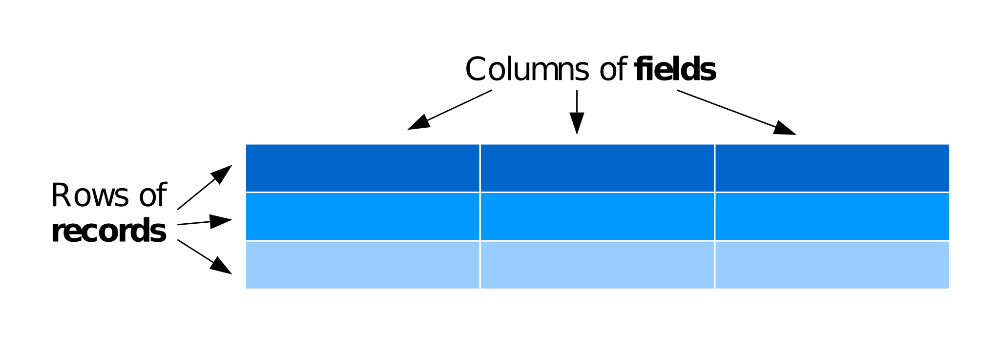

## Database Introduction

In the late 1920s and early 1930s, William Dyer, Frank Pabodie, and Valentina Roerich led expeditions to the <a href="http://en.wikipedia.org/wiki/Pole_of_inaccessibility">Pole of Inaccessibility</a> in the South Pacific, and then onward to Antarctica. Two years ago, their expeditions were found in a storage locker at Miskatonic University. We have scanned and OCR'd the data they contain, and we now want to store that information in a way that will make search and analysis easy.

We basically have three options: text files, a spreadsheet, or a database. Text files are easiest to create, and work well with version control, but then we would then have to build search and analysis tools ourselves. Spreadsheets are good for doing simple analysis, they don't handle large or complex data sets very well. We would therefore like to put this data in a database, and these lessons will show how to do that.

<h4 id="objectives">Objectives</h4>
<ul>
<li>Explain the difference between a record, and a field.</li>
<li>Explain the difference between a database and a database manager.</li>
<li>Write a query to select all values for specific fields from a single table.</li>
</ul>

### What is a Database?

<blockquote>
<h4>database (dā'tə-bās') <em>noun</em></h4>

A collection of data arranged for ease and speed of search and retrieval by a computer.

</blockquote>
<blockquote>

<small><a href="http://dictionary.reference.com/browse/database">The American Heritage® Science Dictionary</a></small>

</blockquote>

The simplest kind of database stores data in a <a href="../../gloss.html#table-database">table</a> containing columns of <a href="../../gloss.html#field-database">fields</a> which describe the data and rows of <a href="../../gloss.html#record-database">records</a> which contain the data.

fields and records

To start bringing in data from the Pole of Inaccessibility expedition, we'll put the explorers names in the table. This table has the fields '<strong>Personal</strong>' and '<strong>Family</strong>' and each record has the '<strong>Personal</strong>' and '<strong>Family</strong>' name of one of the explorers.

<h4 id="person">Person</h4>
<table>
    <tr>
        <th>
Personal
</th>
        <th>
Family
</th>
    </tr>
    <tr>
        <td>
William
</td>
        <td>
Dyer
</td>
    </tr>
    <tr>
        <td>
Frank
</td>
        <td>
Pabodie
</td>
    </tr>
    <tr>
        <td>
Anderson
</td>
        <td>
Lake
</td>
    </tr>
    <tr>
        <td>
Valentina
</td>
        <td>
Roerich
</td>
    </tr>
    <tr>
        <td>
Frank
</td>
        <td>
Danforth
</td>
    </tr>   
</table>

Since everything so far in the table is related to a person, this will be named the <strong>Person</strong> table

### Database Manager

When we are using a spreadsheet, we put formulas into cells to calculate new values based on old ones. When we are using a database, we send commands (usually called <a href="../../gloss.html#query">queries</a>) to a <a href="../../gloss.html#database-manager">database manager</a>: a program that manipulates the database for us. The database manager does whatever lookups and calculations the query specifies, returning the results in a tabular form that we can then use as a starting point for further queries.

<blockquote>

Every database manager—Oracle, IBM DB2, PostgreSQL, MySQL, Microsoft Access, and SQLite—stores data in a different way, so a database created with one cannot be used directly by another. However, every database manager can import and export data in a variety of formats, so it <em>is</em> possible to move information from one to another.

</blockquote>

For these examples we will be using <a href="http://www.sqlite.org/">sqlite</a> as our database manager to access our database. To load sqlite:

<pre>%load_ext sqlitemagic</pre>

#### Creating the Person Database

To create our database with one table, we'll load the .sql file that defines and loads the <code>Person</code> table into a database called person.db.

<pre>!sqlite3 person.db &lt; gen-person-database.sql</pre>

<pre>Error: near line 2: table Person already exists
</pre>

This just runs the content of the <code>gen-person-database.sql</code> file and loads into a database named person.db. The contents of gen-person-database.sql are copied out below for your reference:

-- The `Person` table is used to explain the most basic queries.
-- Creating the table with the fields `personal` and `family`
create table Person(
  personal text,
  family	 text
);

-- Inserting data into the `Person` table, one record per person
insert into Person values('William',   'Dyer');
insert into Person values('Frank',     'Pabodie');
insert into Person values('Anderson',  'Lake');
insert into Person values('Valentina', 'Roerich');
insert into Person values('Frank',     'Danforth');

### Selecting Data

Queries are written in a language called <a href="../../gloss.html#sql">SQL</a>, which stands for &quot;Structured Query Language&quot;. SQL provides hundreds of different ways to analyze and recombine data; we will only look at a handful, but that handful accounts for most of what scientists do.

<h4 id="person">Person</h4>
<table>
    <tr>
        <th>
Personal
</th>
        <th>
Family
</th>
    </tr>
    <tr>
        <td>
William
</td>
        <td>
Dyer
</td>
    </tr>
    <tr>
        <td>
Frank
</td>
        <td>
Pabodie
</td>
    </tr>
    <tr>
        <td>
Anderson
</td>
        <td>
Lake
</td>
    </tr>
    <tr>
        <td>
Valentina
</td>
        <td>
Roerich
</td>
    </tr>
    <tr>
        <td>
Frank
</td>
        <td>
Danforth
</td>
    </tr>   
</table>

Now, using our <code>Person</code> table, let's write a few queries.

Let's write an SQL query that displays scientists' names. We do this using the SQL command <code>select</code>, giving it the names of the columns we want and the table we want them from. Our query and its output look like this:

<pre>%%sqlite person.db
select personal, family from Person;</pre>

<pre><table>
<tr><td>William</td><td>Dyer</td></tr>
<tr><td>Frank</td><td>Pabodie</td></tr>
<tr><td>Anderson</td><td>Lake</td></tr>
<tr><td>Valentina</td><td>Roerich</td></tr>
<tr><td>Frank</td><td>Danforth</td></tr>
</table></pre>

The semi-colon at the end of the query tells the database manager that the query is complete and ready to run. We have written our commands and column names in lower case, and the table name in Title Case, but we don't have to: as the example below shows, SQL is <a href="../../gloss.html#case-insensitive">case insensitive</a>.

<pre>%%sqlite person.db
SeLeCt PeRsOnAl, FaMiLy FrOm PeRsOn;</pre>

<pre><table>
<tr><td>William</td><td>Dyer</td></tr>
<tr><td>Frank</td><td>Pabodie</td></tr>
<tr><td>Anderson</td><td>Lake</td></tr>
<tr><td>Valentina</td><td>Roerich</td></tr>
<tr><td>Frank</td><td>Danforth</td></tr>
</table></pre>

Whatever casing convention you choose, please be consistent: complex queries are hard enough to read without the extra cognitive load of random capitalization.

Going back to our query, it's important to understand that the rows and columns in a database table aren't actually stored in any particular order. They will always be <em>displayed</em> in some order, but we can control that in various ways. For example, we could swap the columns in the output by writing our query as:

<pre>%%sqlite person.db
select family, personal from Person;</pre>

<pre><table>
<tr><td>William</td><td>Dyer</td></tr>
<tr><td>Frank</td><td>Pabodie</td></tr>
<tr><td>Anderson</td><td>Lake</td></tr>
<tr><td>Valentina</td><td>Roerich</td></tr>
<tr><td>Frank</td><td>Danforth</td></tr>
</table></pre>

or even repeat columns:

<pre>%%sqlite person.db
select family, family, family from Person;</pre>

<pre><table>
<tr><td>Dyer</td><td>Dyer</td><td>Dyer</td></tr>
<tr><td>Pabodie</td><td>Pabodie</td><td>Pabodie</td></tr>
<tr><td>Lake</td><td>Lake</td><td>Lake</td></tr>
<tr><td>Roerich</td><td>Roerich</td><td>Roerich</td></tr>
<tr><td>Danforth</td><td>Danforth</td><td>Danforth</td></tr>
</table></pre>

As a shortcut, we can select all of the columns in a table using <code>*</code>:

<pre>%%sqlite person.db
select * from Person;</pre>

<pre><table>
<tr><td>William</td><td>Dyer</td></tr>
<tr><td>Frank</td><td>Pabodie</td></tr>
<tr><td>Anderson</td><td>Lake</td></tr>
<tr><td>Valentina</td><td>Roerich</td></tr>
<tr><td>Frank</td><td>Danforth</td></tr>
</table></pre>

<h4 id="challenges">Challenges</h4>
<ol style="list-style-type: decimal">
<li>
Write a query that selects only personal names from the <code>Person</code> table.
</li>
<li>
Many people format queries as:

<pre><code>SELECT personal, family FROM person;</code></pre>

or as:

<pre><code>select Personal, Family from PERSON;</code></pre>

What style do you find easiest to read, and why?
</li>
</ol>

<h4 id="key-points">Key Points</h4>
<ul>
<li>A relational database stores information in tables, each of which has a fixed set of columns and a variable number of records.</li>
<li>A database manager is a program that manipulates information stored in a database.</li>
<li>We write queries in a specialized language called SQL to extract information from databases.</li>
<li>SQL is case-insensitive.</li>
</ul>

